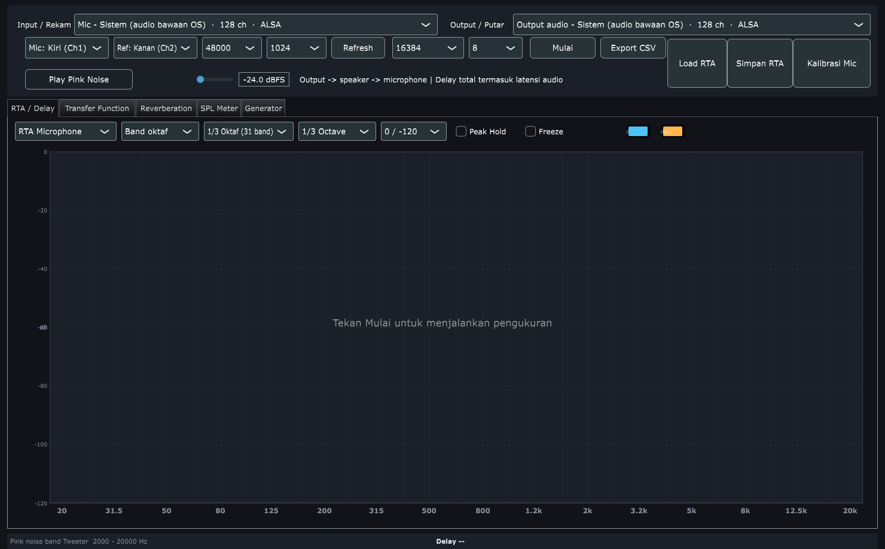
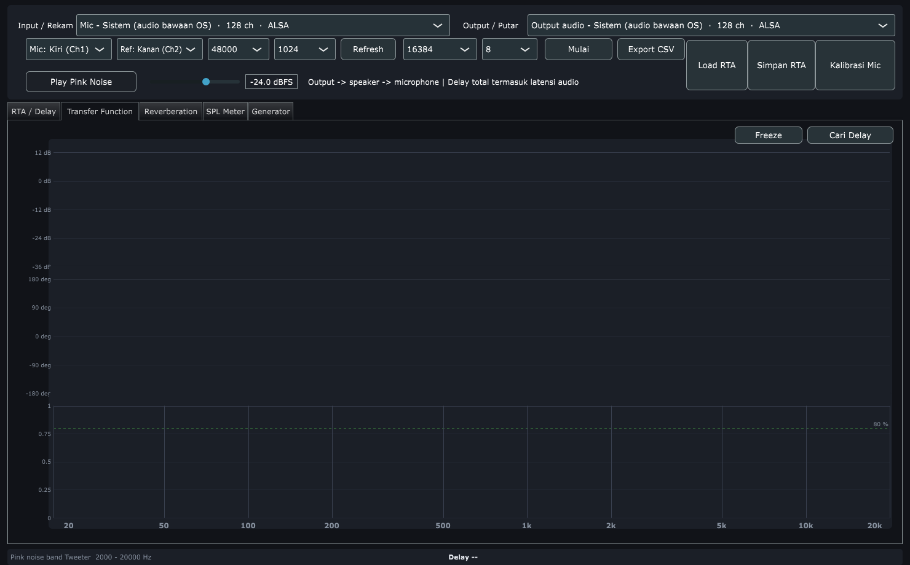
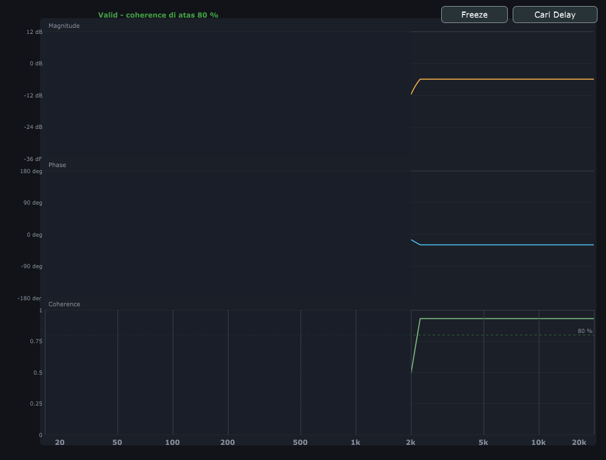
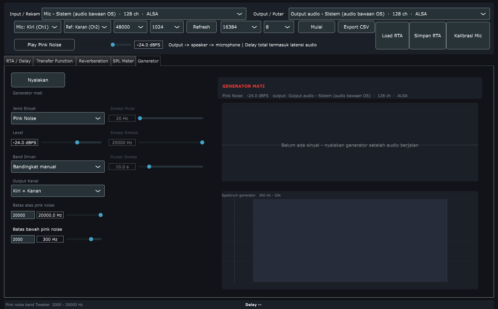
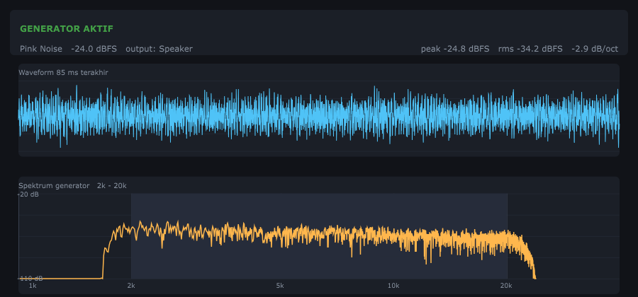

# OpenSmaartLab

Independent real-time acoustic measurement application, built around the workflow of
professional dual-channel FFT analysers.

Two implementations live in this repository:

| Folder | Stack | Purpose |
| --- | --- | --- |
| `JUCE/` | C++20, JUCE 7.0.12 | Native desktop build, the full measurement tool |
| `main.py` | Python, PySide6 + pyqtgraph | Cross-platform reference implementation |

Use the C++ build for serious work: it is the only one that keeps a two-channel
measurement stable under load, and the only one with the Transfer Function tab, the
per-driver generator bands and separate left/right channel assignment.



---

## Tabs

| Tab | What it is for |
| --- | --- |
| **RTA / Delay** | Live spectrum against live input, plus the delay reading |
| **Transfer Function** | Magnitude, phase and coherence of one dual-channel measurement |
| **Reverberation** | Impulse response, energy decay curve, Schroeder decay, RT estimates |
| **SPL Meter** | Sound pressure level with A / C / Z weighting, peak and Leq |
| **Generator** | Pink noise, white noise, sine and sweep, with driver bands |

---

## Features

### Transfer Function





- Magnitude, phase and coherence of the same measurement, stacked on one frequency axis
- Coherence is computed only where the reference carries signal. Bins outside the
  excited band are blanked and shaded, because their coherence is the ratio of two
  near-zero powers and would otherwise read as a confident 100 %
- The average coherence is weighted by reference power, so it describes the band being
  measured instead of being averaged across the whole axis
- A validity line at 80 % coherence, because below that the measurement is not usable
  however good the curve looks
- **Cari Delay** searches for the first impulse peak once and restarts the averages, so
  every averaged frame shares one delay compensation instead of a new delay being
  folded into a running average
- Traces break where the reference carried no signal, rather than drawing a flat run of
  meaningless values
- Smoothed over a third of an octave, matching the rest of the app

### RTA display

- Two styles: octave bands, or 100 evenly spaced bars on a linear frequency axis
- Band resolution from 1/1 octave up to 1/12 octave
- Band centres follow the ISO 266 nominal frequency table (20 Hz, 25, 31.5, 40, …)
- Every band is labelled with its frequency, sized so all 31 labels fit
- Bars tile the plot exactly: no gaps, no clipping at 20 Hz or 20 kHz
- Per-trace RMS and peak, hidden when a channel is silent
- Peak hold and freeze
- Per-trace colour picker, remembered between sessions
- DC offset and sub-audio content are excluded from the lowest band, so a USB
  interface sitting a few millivolts off zero does not read as a loud low band

### Channel assignment

- **Mic** and **Ref** are assigned to the left and right input on their own, so a
  microphone on one input and a loopback tap on the other is an ordinary wiring rather
  than a swap of a fixed pair
- Assigning both to the same channel is refused: the reference moves instead, because a
  channel compared with itself reads as a perfectly flat transfer function
- The generator can feed one output side only, leaving the other silent, so an
  amplifier can be fed from one output while the reference tap stays separate
- A mono input still supports RTA: it becomes the measurement, and the reference is
  left silent rather than copied
- The legend names the channel behind each trace

### Signal generator



- Pink noise, white noise, sine and logarithmic sweep
- Driver bands for pink noise: subwoofer, woofer, midrange, tweeter, or the full
  20 Hz - 20 kHz band. Room correction is done one driver at a time, and coherence or
  level measured across a whole speaker is a blend of a subwoofer and a tweeter
- A hand set band reports itself as manual instead of claiming a driver preset
- Frequency and both band limits can be typed exactly, next to their sliders
- The spectrum plot follows the settings: the axis zooms onto the selected band, tone or
  sweep range, the band edges are shaded, a sweep shows where it currently is, and the
  header reports the tilt of the band being generated



- The plot clears when the generator stops, so an old spectrum cannot sit next to
  settings that were never played

### Reverberation

- Impulse response drawn as an energy time curve
- Schroeder decay with a fitted T30 line
- Acoustic parameters: EDT, T20, T30, RT60
- Delay finder using normalised cross-correlation, with a confidence figure

### SPL meter

- A / C / Z weighting, Fast and Slow time constants
- Peak hold and Leq
- Calibration offset

### Microphone calibration

- Sensitivity conversion from dBFS to dB SPL
- Frequency response correction, interpolated per FFT bin
- Reads Dayton Audio `.txt` calibration files, including the per-serial-number
  sensitivity line (`*1000Hz<TAB>-38.5`)
- Only the microphone channel is calibrated. The reference is usually a loopback of the
  generator, so correcting it would break the transfer function
- Off by default. Calibration is opt-in from the **Kalibrasi Mic** menu, because
  switching to dB SPL moves the trace outside the default display window

### Capture

- Save the current RTA under a name, with the calibration note embedded
- Load it back later to compare against live input, from the default folder, the folder
  used last, or a folder you choose
- CSV export of the raw spectrum

### Devices

- HDMI and DisplayPort outputs are hidden: they carry no audio worth measuring
- Bluetooth sinks are listed through PipeWire, and labelled as Bluetooth
- Channels are named from the ALSA jack names, because JUCE labels every ALSA input
  channel just "channel"

---

## Build

### C++ / JUCE

Requires CMake 3.22+, a C++20 compiler, and the JUCE dependencies, which CMake fetches
automatically.

```bash
cd JUCE
cmake -B build -DCMAKE_BUILD_TYPE=Release
cmake --build build -j$(nproc)
./build/OpenSmaartLab_artefacts/Release/OpenSmaartLab
```

On Debian/Ubuntu the GUI backend needs GTK development headers:

```bash
sudo apt install libgtk-3-dev libasound2-dev libcurl4-openssl-dev
```

### Python

Ubuntu / Mint:

```bash
sudo apt install python3-venv libportaudio2 portaudio19-dev
python3 -m venv .venv
source .venv/bin/activate
pip install -r requirements.txt
python main.py
```

Windows:

```powershell
py -m venv .venv
.venv\Scripts\activate
pip install -r requirements.txt
python main.py
```

ASIO support depends on the PortAudio build and the installed interface driver.

---

## Tests

```bash
cd JUCE/build
xvfb-run ctest --output-on-failure
```

Two targets:

- `audio_checks` covers the DSP path. The transfer function is measured against a known
  path: a band limited source, a known gain and a known lag, so the reported magnitude,
  coherence and delay are compared against what was injected. Also covered: blanked
  bins, the coherence of a noisy measurement, a silent reference, the delay search, the
  driver band presets, the band tables, DC rejection, calibration parsing and the
  snapshot round trip.
- `ui_checks` builds the real panels, drives the controls and writes screenshots to
  `/tmp`: that a driver band reaches the generator, that a hand set band reports itself
  as manual, that the channel assignment and output routing reach the audio engine, and
  that the Transfer Function tab renders magnitude, phase and coherence.

`xvfb-run` is needed because the UI checks need a display server; without it the GUI
target cannot start.

Python:

```bash
source .venv/bin/activate
python -m unittest discover -s tests
```

---

## Measurement wiring

For a transfer-function measurement:

- **Measurement input**: measurement microphone
- **Reference input**: direct electrical loop or mixer reference
- **Output**: generator to the system under test

Choose the input for **Mic** and **Ref** in the toolbar, then start. To keep the loopback
separate from the generator output itself, set **Output Kanal** to one side.

Delay needs two inputs captured simultaneously on the same interface: one microphone and
one electrical reference carrying the same signal. Use broadband noise. Positive delay
means the microphone signal arrives later than the reference. Without a usable reference
the reading shows `--`, and a microphone on its own still supports RTA. This measures
relative arrival time, including differences between the signal paths, not speaker
distance by itself.

### Measuring one driver

Room correction is done one driver at a time:

1. In the **Generator** tab pick the driver band, for example **Tweeter 2000 - 20000 Hz**.
   A sweep from 2 kHz to 20 kHz works for the same band.
2. Set the level, and check the generator spectrum: the trace must sit inside the
   shaded band.
3. Start the generator and open the **Transfer Function** tab.
4. Press **Cari Delay** once, so the phase and the impulse line up.
5. Watch the validity line. Coherence below 80 % means the measurement is not usable
   yet: check the reference channel carries the same signal, lower the level if the
   measurement clips, and average longer.

---

## SPL calibration

With an acoustic calibrator (for example 94 dB @ 1 kHz):

1. Place the calibrator on the measurement microphone.
2. Open the SPL Meter tab.
3. Adjust the calibration offset until the meter reads the calibrator level.

Software-only SPL values are not standards-compliant until the complete microphone and
interface chain is calibrated.

For the RTA, use **Kalibrasi Mic** to load the microphone's own calibration file instead
of a single offset.

---

## Releases

`dist/` holds the v1.0.0 artefacts and its release notes. `main` has moved on since that
tag, so a build from `main` is newer than the published package.

---

## Notes

This project is an independent implementation. It does not contain Rational Acoustics
source code, artwork, trademarks, proprietary algorithms, or licensed Smaart assets.

Bluetooth output goes through PipeWire: the C++ build enumerates sinks with `pactl` and
routes playback through the ALSA `pipewire` PCM, which means it changes the system
default sink while a measurement is running. Bluetooth (A2DP) also encodes to SBC, so it
is not appropriate for level accuracy. Use analogue or USB output for measurement work.