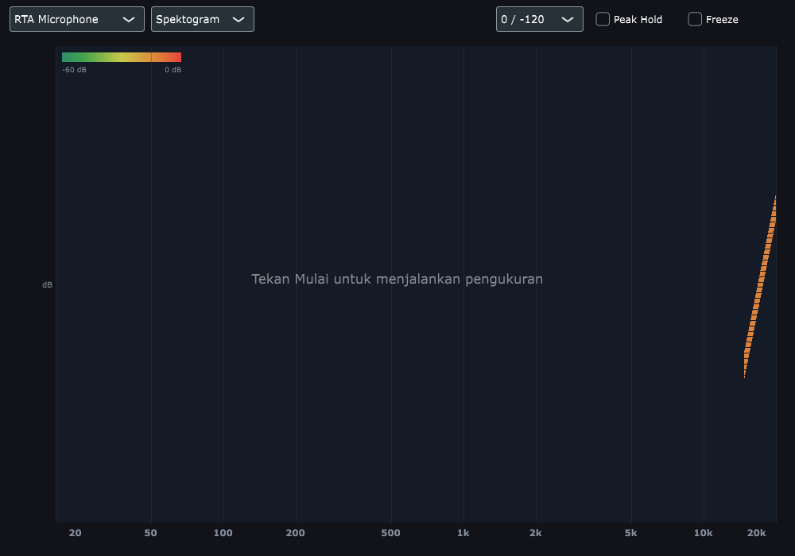

# OpenSmaartLab

Independent real-time acoustic measurement application, built around the workflow of
professional dual-channel FFT analysers.

Two implementations live in this repository:

| Folder | Stack | Purpose |
| --- | --- | --- |
| `JUCE/` | C++20, JUCE 7.0.12 | Native desktop build, the full measurement tool |
| `main.py` | Python, PySide6 + pyqtgraph | Cross-platform reference implementation |

Use the C++ build for serious work: it is the only one that keeps a two-channel
measurement stable under load, and the only one with the Transfer Function tab, the
spectrogram, the per-driver generator bands and separate left/right channel assignment.


---

## Tabs

| Tab | What it is for |
| --- | --- |
| **RTA / Delay** | Live spectrum against live input, as bands, bars, a line or a spectrogram, plus the delay reading. Its octave selector is what configures the band analysis |
| **Transfer Function** | Magnitude, phase and coherence of one dual-channel measurement |
| **Reverberation** | Impulse response, energy decay curve, Schroeder decay, RT estimates |
| **SPL Meter** | Sound pressure level with A / C / Z weighting, peak and Leq |
| **Distorsi** | THD, THD+N, SINAD and the harmonic table of a tone |
| **Impedansi** | Sweep driven impedance measurement |
| **Input Level** | Per channel level, peak and crest factor |
| **Spectrum** | Single frame spectrum with peak read-out |
| **Generator** | Pink noise, white noise, sine and sweep, with driver bands |
| **Rekam** | Record to a WAV file: REC, STOP, PAUSE, SAVE |
| **Offline** | Open a WAV file and run every measurement over it |
| **Session & Export** | Traces, session files, and export to CSV, JSON, WAV and SVG |

---

## Features

### Transfer Function


- Magnitude, phase and coherence of the same measurement, stacked on one frequency axis
- Coherence is computed only where the reference carries signal. Bins outside the
  excited band are blanked and shaded, because their coherence is the ratio of two
  near-zero powers and would otherwise read as a confident 100 %
- The average coherence is weighted by reference power, so it describes the band being
  measured instead of being averaged across the whole axis
- A validity line at 80 % coherence, because below that the measurement is not usable
  however good the curve looks
- The delay is tracked automatically, and every frame is compensated **before** it joins
  the average rather than afterwards. This matters: the speaker is played by the output
  device while the microphone captures on the input one, so on two devices the loop delay
  walks by a few samples from frame to frame. Rotating the finished average leaves the
  frames recorded at another delay rotated against each other, and the coherence then
  falls further the longer it averages instead of rising
- The averages are only thrown away when the delay really moves, by more than 4 samples,
  so jitter does not restart them. **Cari Delay** searches on demand and always restarts
  them, which is what makes the phase and the impulse line up
- The delay the phase and the impulse are compensated with is the one tracked on the
  current frame, and it is what the reading shows. A reading only appears once the search
  has actually found a peak: a delay sitting on the limit of the search, or a generator
  that is not broadband, reports `--` rather than a number that was never measured
- A correlation peak is only believed when the aligned pair still looks like one signal
  once the delay is taken out (`dsp::delayConfidence`). Without that check the search
  happily reports the strongest point of a broad smear of noise, including lags no
  physical path could produce. Magnitude and coherence would still look perfect, because
  neither looks at phase, and only the phase curve would show what had happened
- A search that fails the check holds the last delay it trusted and the reading goes back
  to `--`, instead of rotating the measurement by a delay that was never measured
- `main.py` runs that search every 0.75 s, reports it as `(auto)`, and has an **Auto**
  checkbox to switch it off. A failed automatic search keeps the last reading instead of
  flickering through error messages; the button reports why a search failed, for example
  when the reference is silent or does not match the microphone
- Traces break where the reference carried no signal, rather than drawing a flat run of
  meaningless values
- Bins where the measurement itself has nothing left are left blank as well. A loud
  reference is only half the condition: past 60 dB below it there is no measurement to
  report, and its magnitude would sit below the bottom of the pane anyway
- A bin that carries signal but correlates poorly keeps both curves. Its magnitude reads
  low by the noise it contains and its phase is spread out, and both are facts about the
  measurement; the coherence pane and the validity banner are what report that the band
  cannot be trusted. Only a band with no measurement at all is left blank
- Broadband RMS and peak for both channels in a sidebar on the right, since the magnitude
  curve is normalised and says nothing about how loud the measurement actually was
- Smoothed over a third of an octave, matching the rest of the app

### RTA display

- Four views from the same display: octave bands, 100 evenly spaced bars on a linear
  frequency axis, a plain FFT line, and a scrolling spectrogram
- Band resolution from 1/1 octave up to 1/12 octave
- Band centres follow the ISO 266 nominal frequency table (20 Hz, 25, 31.5, 40, …)
- Every band is labelled with its frequency, sized so all 31 labels fit
- Bars tile the plot exactly: no gaps, no clipping at 20 Hz or 20 kHz
- Per-trace RMS and peak, hidden when a channel is silent
- Peak hold and freeze
- Per-trace colour picker, remembered between sessions
- DC offset and sub-audio content are excluded from the lowest band, so a USB
  interface sitting a few millivolts off zero does not read as a loud low band

### Spectrogram



- Level history scrolling **upwards**, one row per frame of live data: the newest frame
  sits along the bottom, next to the frequency axis, and the past moves up, the way a
  paper recorder leaves a trace. The time axis is real measurement time rather than the
  refresh rate of the window
- Log spaced frequency bands, matching the frequency axis of the other views, averaged
  per band so one loud FFT bin cannot paint a whole band
- Heat scale with the decibel range printed on it, following the same display range
  selector as the axes: changing the range recolours the history that is already on
  screen
- A band that has not been excited stays cold instead of being drawn as a low band
- The colour scale stands in the label column, with the decibel range on it, and the
  frequency axis runs along the bottom
- Freeze stops the scroll; leaving the view drops the history, so its time axis cannot
  silently continue from a moment the user had already left

### Channel assignment

- **Mic** and **Ref** are assigned to the left and right input on their own, so a
  microphone on one input and a loopback tap on the other is an ordinary wiring rather
  than a swap of a fixed pair
- Assigning both to the same channel is refused: the reference moves instead, because a
  channel compared with itself reads as a perfectly flat transfer function
- The generator can feed one output side only, leaving the other silent, so an
  amplifier can be fed from one output while the reference tap stays separate
- A mono input still supports RTA: it becomes the measurement, and the reference is
  left silent rather than copied
- The legend names the channel behind each trace

### Signal generator

Switching the generator on or off, or muting it, **clears the measurement averages**. They are
exponential, so without that the display would show the previous signal fading into the new one
over several time constants — about three seconds — which reads as the measurement being slow
to start when it is only the average remembering. The clear happens on the switch itself and
not on a level change, so it cannot retrigger while a measurement is under way.

### Response speed

The graph averages asymmetrically: **a level that rises is followed about four times faster
than a level that falls.** A symmetric average cannot be both quick and readable — fast enough
to feel responsive and it flickers, smooth enough to read and it feels broken. Breaking the
symmetry is what every hardware display does for the same reason, and it is the difference
between a graph that reacts when a signal arrives and one that eases into it.

It does not change what a steady level reads. Given long enough, both a symmetric and a fast
average land on the same number, which `spectrum_checks` verifies to within half a decibel; the
fast one simply gets there first. Setting the ratio to 1 restores the plain exponential average
exactly.

`RtaAnalyser` carries the same asymmetry, so a band level and the curve drawn from the same
frame rise and fall together instead of one lagging behind the other.

Pink noise is shaped in the frequency domain as `1/√f`, which is what makes it carry equal
power per octave. Measured, its octave levels fall about 3.5 dB per octave across 125 Hz to
4 kHz; white noise relabelled pink would be flat and would fail that.


- Pink noise, white noise, sine and logarithmic sweep
- Driver bands for pink noise: subwoofer, woofer, midrange, tweeter, or the full
  20 Hz - 20 kHz band. Room correction is done one driver at a time, and coherence or
  level measured across a whole speaker is a blend of a subwoofer and a tweeter
- A hand set band reports itself as manual instead of claiming a driver preset
- Frequency and both band limits can be typed exactly, next to their sliders
- The spectrum plot follows the settings: the axis zooms onto the selected band, tone or
  sweep range, the band edges are shaded, a sweep shows where it currently is, and the
  header reports the tilt of the band being generated


- The plot clears when the generator stops, so an old spectrum cannot sit next to
  settings that were never played

### Reverberation

- Impulse response drawn as an energy time curve
- Schroeder decay with a fitted T30 line
- Acoustic parameters: EDT, T20, T30, RT60
- Delay finder using normalised cross-correlation, with a confidence figure, run
  automatically or on demand

### SPL meter

- A / C / Z weighting, Fast and Slow time constants
- Peak hold and Leq
- Calibration offset

### Microphone calibration

- Sensitivity conversion from dBFS to dB SPL
- Frequency response correction, interpolated per FFT bin
- Reads Dayton Audio `.txt` calibration files, including the per-serial-number
  sensitivity line (`*1000Hz<TAB>-38.5`)
- Only the microphone channel is calibrated. The reference is usually a loopback of the
  generator, so correcting it would break the transfer function
- Off by default. Calibration is opt-in from the **Kalibrasi Mic** menu, because
  switching to dB SPL moves the trace outside the default display window

### Capture

- Save the current RTA under a name, with the calibration note embedded
- Load it back later to compare against live input, from the default folder, the folder
  used last, or a folder you choose
- CSV export of the raw spectrum

### Devices

- HDMI and DisplayPort outputs are hidden: they carry no audio worth measuring
- Bluetooth sinks are listed through PipeWire, and labelled as Bluetooth
- Channels are named from the ALSA jack names, because JUCE labels every ALSA input
  channel just "channel"

---

## Recording

The **Rekam** tab records the live input to a WAV file.

| Control | What it does |
| --- | --- |
| **REC** | Opens a file and starts recording |
| **STOP** | Stops accepting audio and writes out what is still buffered |
| **PAUSE** | Holds the file. Audio arriving while paused is discarded, not written |
| **SAVE** | Closes the file and leaves it where SAVE asks |

Supported depths are 16-bit, 24-bit and 32-bit float. Supported rates are 44100,
48000, 96000 and 192000 Hz. **Twenty four bit is the default**: sixteen bit has no
headroom for a quiet measurement, and float is for files that will be processed again
because nothing is quantised or clipped on the way in.

A recording is taken at the sample rate the device is actually running at, never at a
rate it is asked to convert to. A resampler in the middle of a measurement makes the file
a different measurement from the live one.

**PAUSE discards rather than inserts.** Audio arriving during a pause is thrown away and
the recording continues from the resume point, so the file stays one continuous waveform
with no silence inserted into it. Inserting the gap as silence would put a step in the
waveform that reads as a real reflection. The discarded time is counted and reported on
the panel.

Recording is written from a background pump, never from the audio callback. The callback
hands samples to a lock free ring and returns; a timer on the message thread moves them
into the file. If that pump ever falls more than two seconds behind, samples are dropped
and the count is shown on the panel, because a recording that quietly skips is worse than
one that admits a gap.

## Offline analysis

The **Offline** tab opens a WAV file and runs every measurement over it: spectrum, RTA,
THD, transfer function, impulse response, reverberation and sound pressure level.

**The offline path uses the same analysers as the live path.** Every number it reports
comes out of the same `SpectrumAnalyser`, `RtaAnalyser`, `DistortionAnalyser`,
`TransferFunction`, `SplAnalyser`, `ImpulseResponse` and `ReverbAnalyser` objects the
live meters use, fed the same way. There is no second implementation. That is what makes
a file and a live input of the same audio give the same answer, and it is checked by
`recording_checks`, which analyses a recorded file and the same samples directly and
compares the peak frequency, the peak level, the average level, every RTA band, the
weighted level and the measured delay between them.

Each measurement either reports a value or states why it cannot. A blank report is the
one outcome that cannot be acted on.

---

## Traces and sessions

The **Session & Export** tab holds the six traces a comparison is made from.

| Trace | What it is |
| --- | --- |
| **Live** | What the instrument is reading now |
| **Reference** | The curve the room is supposed to have |
| **Measurement** | A reading that has been frozen so it stops moving |
| **Average** | A running mean of every curve folded into it |
| **Memory** | A curve held across sessions |
| **Difference** | One trace minus another |

**Difference** is computed between any two named traces, matched bin by bin *by
frequency* rather than by index, because the two curves may have come from different
transform sizes and index `n` of one is not the same frequency as index `n` of the
other. **Compare** reports the root mean square of the difference in decibels and the
largest single bin difference with the frequency it is at.

**Memory does not survive a clear**, which is the point of it. A session file is what
carries a curve from one session to the next.

### Session files

**Simpan Session** writes everything the measurement depended on to a `.osls` file:
device names, sample rate, buffer size, channel assignment, microphone calibration, FFT
and RTA settings, the measurement settings, all six traces, and the notes.

A session is json with an `.osls` extension, and the reason is not convenience: a session
has to be readable when something has gone wrong with it, it has to survive a version of
the application that knows some of the fields, and a saved session is the first thing
anyone looks at when a measurement is disputed.

A file from a newer format version is refused whole rather than read in part. Half reading
one produces a session that looks complete and has silently dropped whatever the reader
did not know about, which is worse than refusing. Settings that come back out of range
are put back in range rather than obeyed.

**measure → save → close → reopen → continue** is checked directly by
`session_checks`, which writes a session, empties the object it came from, reads the file
back, and compares every value that gave the measurement its meaning.

### Export

Every export names its units, its axis names and what produced it inside the file, rather
than leaving that to whoever opens it six months later.

| Kind | Formats |
| --- | --- |
| FFT, RTA, Magnitude, Phase, Coherence, ETC, RT60, THD, THD+N, Noise, SPL | CSV, JSON, SVG |
| Impulse | WAV, CSV |

CSV writes two columns with a header. JSON keeps the axis names and units and can carry a
label per point, which is what a reverberation table needs since its x axis is a band and
not a number. SVG is a vector plot on a fixed page, so two exports of the same measurement
come out the same size and can be laid side by side in a report.

---

## Build

### C++ / JUCE

Requires CMake 3.22+, a C++20 compiler, and the JUCE dependencies, which CMake fetches
automatically.

```bash
cd JUCE
cmake -B build -DCMAKE_BUILD_TYPE=Release
cmake --build build -j$(nproc)
./build/OpenSmaartLab_artefacts/Release/OpenSmaartLab
```

On Debian/Ubuntu the GUI backend needs GTK development headers:

```bash
sudo apt install libgtk-3-dev libasound2-dev libcurl4-openssl-dev
```

### Python

Ubuntu / Mint:

```bash
sudo apt install python3-venv libportaudio2 portaudio19-dev
python3 -m venv .venv
source .venv/bin/activate
pip install -r requirements.txt
python main.py
```

Windows:

```powershell
py -m venv .venv
.venv\Scripts\activate
pip install -r requirements.txt
python main.py
```

ASIO support depends on the PortAudio build and the installed interface driver.

---

## Tests

Sixteen test binaries, all of them runnable with `ctest`:

```bash
cd JUCE/build
ctest --output-on-failure
```

| Suite | What it holds to account |
| --- | --- |
| `audio_checks` | Engine transport, channel routing, device loss and reconnection |
| `level_checks` | Peak, rms, crest factor and the dB helpers |
| `spectrum_checks` | Window conventions, coherent gain, peak finding, dropped frames |
| `rta_checks` | Band edges, resolution, averaging, unresolved bands |
| `transfer_function_checks` | Magnitude, phase, coherence, delay, impulse, averaging |
| `phase_delay_checks` | Wrapped and unwrapped phase, phase-slope delay, distance, temperature |
| `generator_checks` | All eight waveforms, polyBLEP, sweeps, mute, frequency accuracy |
| `calibration_checks` | SPL calibration, weightings against published curves, time constants |
| `distortion_checks` | THD, THD+N, SINAD and the harmonic table against known amplitudes |
| `advanced_measurements_checks` | SMPTE and CCIF intermodulation, crosstalk, polarity |
| `reverb_checks` | RT60 per band, decay quality states, decay beyond float resolution |
| `recording_checks` | WAV round trip at three depths, offline results against live results |
| `session_checks` | Traces, session round trip, export in four formats |
| `validation_checks` | Every measurement against a worked-out number, plus stress, performance and numerical safety |
| `eq_checks` | Auto-EQ fitting and export |
| `ui_checks` | Interface construction |

A test that compares a reading with itself proves nothing. Every figure in
`validation_checks` is held against a number that can be worked out in advance: the rms of a
full scale sine, the six point zero two decibels of halving an amplitude, the sixty decibels
per second of a one second room, the published A and C weighting curves, a known delay, a
known ratio.

## Measurement wiring

For a transfer-function measurement:

- **Measurement input**: measurement microphone
- **Reference input**: direct electrical loop or mixer reference
- **Output**: generator to the system under test

Choose the input for **Mic** and **Ref** in the toolbar, then start. To keep the loopback
separate from the generator output itself, set **Output Kanal** to one side.

Delay needs two inputs captured simultaneously on the same interface: one microphone and
one electrical reference carrying the same signal. Use broadband noise. Positive delay
means the microphone signal arrives later than the reference. Without a usable reference
the reading shows `--`, and a microphone on its own still supports RTA. This measures
relative arrival time, including differences between the signal paths, not speaker
distance by itself.

### Measuring one driver

Room correction is done one driver at a time:

1. In the **Generator** tab pick the driver band, for example **Tweeter 2000 - 20000 Hz**.
   A sweep from 2 kHz to 20 kHz works for the same band.
2. Set the level, and check the generator spectrum: the trace must sit inside the
   shaded band.
3. Start the generator and open the **Transfer Function** tab.
4. Let the automatic search run, or press **Cari Delay** once, so the phase and the
   impulse line up. In `main.py` a reading marked `(auto)` was found by the app itself.
5. Watch the validity line. Coherence below 80 % means the measurement is not usable
   yet, and averaging longer will not lift it on its own: check the reference channel
   carries the same signal, lower the level if the measurement clips, and look at what
   caps the coherence. Room noise and microphone self-noise put a ceiling on it, a USB
   microphone several decimetres from the driver is the usual reason, and a reference
   taken from the generator on a different device than the microphone cannot beat it no
   matter how long it averages.

---

## SPL calibration

With an acoustic calibrator (for example 94 dB @ 1 kHz):

1. Place the calibrator on the measurement microphone.
2. Open the SPL Meter tab.
3. Adjust the calibration offset until the meter reads the calibrator level.

Software-only SPL values are not standards-compliant until the complete microphone and
interface chain is calibrated.

For the RTA, use **Kalibrasi Mic** to load the microphone's own calibration file instead
of a single offset.

---

## What each measurement means

### FFT

The fast Fourier transform turns a block of samples into a set of frequency bins. A sine of
amplitude *A* spread over a window lands in one bin, and the bin's value depends on the
window: each window trades the width of its main lobe against how much it leaks into its
neighbours, and against how much of a tone's amplitude it keeps.

The readings on this panel are **amplitude calibrated**, so a tone reads its own amplitude
whichever window is selected, and the window's coherent gain has already been divided out.
What is left is scalloping, the dip a tone suffers by falling between two bins, which is
bounded by the window and is not an error.

Transform sizes offered: 1024 to 65536. Past 16384 the extra resolution costs time without
adding anything a measurement can use, because a bin narrower than the length of the window
buys no information about a signal that is not stationary over the whole window.

### RTA

The real time analyser groups the FFT bins into octave or third-octave bands. Over 20 Hz to
20 kHz one octave is about eleven bands, and a third octave is about sixty.

**A band is reported as unresolved when it is narrower than one FFT bin.** The low bands run
out of resolution first, and a band reading is held flat rather than allowed to jump about.
`isFullyResolved()` and the unresolved count are on the panel so this is visible rather
than inferred.

### Transfer Function

With two channels, the transfer function is the ratio of the measurement to the reference
in every bin, together with the phase difference and the coherence.

- **Magnitude** is `20·log₁₀` of the cross spectrum over the square root of the two power
  spectra. A channel against itself reads 0 dB. Half the amplitude reads −6.02 dB.
- **Phase** is the angle of the same cross spectrum, wrapped, unwrapped, and optionally
  smoothed. Smoothing makes the curve easier to follow and cannot sharpen the delay
  estimate, so it is off when the phase is being read for a delay.
- **Coherence** is how much of the measurement at that frequency is actually related to the
  reference. It is near 1 only where the two channels carry the same signal. Below about
  four averages the coherence is not yet meaningful and the panel says so, because quoting a
  coherence figure computed from one frame would invite belief it cannot support.
- **Delay** is measured two ways: from the peak of the cross correlation, and from the slope
  of the unwrapped phase. When they agree the reading is trusted. A correlation peak is only
  as good as its peak-to-noise, so when the direct sound is weak the peak is not believed.

Loop delay moves as soon as the speaker and the microphone run off two different device
clocks, which is the normal case. It is therefore tracked on every frame and each frame is
compensated before it joins the average.

### Impulse response

The inverse transform of the transfer function. With delay compensation on, the impulse has
been rotated back so its peak is at zero, which is the compensated curve. With compensation
off, the peak sits at the delay, which is the true impulse response of the system.

### Energy decay curve and RT60

The Schroeder backward integral sums the energy from the end of the response backwards,
which gives the decay of a room as one curve. Three times are read off it:

| | Fitted over | Quoted at |
| --- | --- | --- |
| **EDT** | 0 to −10 dB | 60 dB |
| **T20** | −5 to −25 dB | 60 dB |
| **T30** | −5 to −35 dB | 60 dB |

All three name the range they were fitted over, not the distance they are quoted over.
A Schroeder curve falls at 60 dB over the reverberation time, so a room built to one second
falls at 60 dB per second.

Three quality states are reported, and each is a refusal rather than an answer:

| State | What it means |
| --- | --- |
| **VALID** | The curve is close to a straight line and continues past the fitted range |
| **INSUFFICIENT DECAY** | The response never fell far enough to support a reading |
| **NOISY** | The decay stops where it was fitted, which is what a noise floor looks like |

Nothing is reported as a time unless the deepest range fitted, because a curve that stops at
20 dB cannot support a 35 dB answer, and extrapolating one to it would be arithmetic rather
than measurement.

### THD, THD+N and SINAD

- **THD** is the root sum of the harmonic powers over the fundamental power.
- **THD+N** is the same with the noise added in.
- **SINAD** is the inverse of THD+N in decibels.

The harmonic search is bounded, and the limits are on the panel, because a search wide enough
to find everything also finds the window's own leakage.

### SPL

Sound pressure level is a calibrated measurement, not a level in decibels. The meter answers
in decibels re full scale, and the microphone calibration is what turns those into sound
pressure. The conversion is the reference level plus the departure from the reading the chain
gave while the calibrator was applied.

Three weightings: Z is flat, A follows the curve that models the ear's sensitivity, and C is
nearly flat until well into the top octave. A and C are not one formula with a corner
swapped; they differ in the power of frequency in the numerator, which is the whole difference
between them.

## Audio setup

### Choosing an interface

A dual-channel FFT analyser needs two inputs and two outputs, and the pairing matters more
than the specification:

- **Both inputs must be genuinely simultaneous.** Two converters that time-multiplex share one
  converter, and everything above a few kilohertz decorrelates between them. That shows up as
  coherence falling with frequency, which is a property of the interface and not of the room.
- **The reference tap should come from the amplifier's input or output**, not from a second
  microphone. Two microphones measuring the same speaker are measuring two different paths.
- **Word length should be at least 24-bit.** A 16-bit converter has about 96 dB of range,
  which is exhausted by a room before the measurement is finished.

### USB interfaces

- **Connect the interface before starting the application** and leave it connected. A device
  enumerated at startup and then re-enumerated by the operating system looks like a device
  that lost its settings, which is what `onDeviceLost` reports.
- **Do not unplug the interface while audio is running.** The device disappears, the callback
  stops, and the application resets its measurement state and reports the loss. Automatic
  reconnection is on by default and reopens the device with the settings the last successful
  start used, so a brief unplug does not need the window restarted.
- **Bus-powered interfaces share the bus with anything else on it.** A laptop on battery with
  a USB interface, a wireless radio and a camera is a machine whose USB ground is moving. On
  mains power the same machine is usually quiet.
- **Sample rates above 48 kHz are only worth taking if the converters genuinely support them.**
  At 192 kHz with a 1024 buffer the callback has 5.3 ms, and a UI that redraws on the message
  thread competes for the same cores.

### Sample rate and buffer size

| Buffer | Callback budget at 48 kHz | At 192 kHz |
| --- | --- | --- |
| 128 | 2.67 ms | 0.67 ms |
| 512 | 10.67 ms | 2.67 ms |
| 2048 | 42.67 ms | 10.67 ms |

Measured cost of the analysis chain on this machine is about 0.08 % of the budget at every
combination offered, and the capture copy is about 0.001 %, so the budget is not the limit.
The limit on a very small buffer is the operating system's own scheduling.

---

## Troubleshooting

**The meters show nothing.**
The device must be running. Check the status line at the bottom: it reports the callbacks the
device has run and the sample rate. If it reads zero callbacks, the device did not open. Try
a different input.

**Coherence falls as frequency rises.**
Almost always the interface. Two converters time-multiplexing share one converter and
decorrelate above a few kilohertz. Confirm it by measuring one channel into both inputs: if
coherence still falls with frequency, it is the interface and not the wiring.

**The delay reading will not settle.**
The delay is tracked per frame and moves when the speaker and the microphone run off different
device clocks, which is the normal case. If it will not settle at all, the reference is not
carrying the same signal as the measurement — check that the generator is actually reaching
the reference tap, and that the reference channel is assigned to the right input.

**A reading says NOISY or INSUFFICIENT DECAY.**
This is a refusal and it means the response did not support the measurement. NOISY usually
means the tail of the decay has reached the noise floor, which happens when the level is too
low or the recording too short. INSUFFICIENT DECAY means the response never fell 35 dB. Raise
the level, record longer, or use a larger transform.

**The level reads far too high or too low.**
Check the microphone calibration. A chain calibrated against the wrong calibrator level, or
with a calibrator whose output is not actually at the stated level, shifts every reading by
exactly that error. `Kalibrasi Mic` on the main panel shows the active profile and its date.

**Nothing appears in a tab.**
Some tabs only compute while visible. Open the tab and the measurement starts; this is a
deliberate choice over running every analyser all the time.

**A recording saved but the file is not there.**
Recording writes to the folder chosen with **Pilih Folder Rekaman**, and SAVE reports the
full path it wrote to. A discarded recording deletes its file.

**The console fills with "jack server is not running" on startup.**

This is not the application. OpenSmaartLab contains no JACK code and is not linked against
`libjack`. What happens is that `/etc/alsa/conf.d/50-jack.conf` declares a `pcm.jack` device of
`type jack`, so when the application enumerates audio devices — which any audio application has
to do — ALSA loads `libasound_module_pcm_jack.so`, which loads `libjack.so.0`, which then finds
no JACK server and logs it to stderr. It repeats because device enumeration repeats.

Confirmed by tracing which library gets loaded:

```
calling init: /usr/lib/x86_64-linux-gnu/alsa-lib/libasound_module_pcm_jack.so
```

On a PipeWire machine JACK is normally not in use at all, and the file is dead weight. Either
move it aside, which needs root:

```bash
sudo mv /etc/alsa/conf.d/50-jack.conf /etc/alsa/conf.d/50-jack.conf.disabled
```

Or shadow it without root, by putting this in `~/.asoundrc`:

```
pcm.jack {
	type null
}
```

The second was measured: JACK messages go from 6 lines to 0, and nothing else is added. **Remove
it before installing JACK for real**, because it turns the `jack` PCM into a null device:

```bash
rm ~/.asoundrc
```

**A session will not open.**
A session from a newer version of the application is refused rather than half-read, and the
panel says so. Open it in the version that wrote it, or start a new session and note what is
different.

---

## Releases

`dist/` holds the v1.1.1 artefacts and its release notes: a Linux x86-64 tarball, which is
the 1.1.0 build unchanged, republished without the withdrawn Windows installer. `main` has
moved on since that tag, so a build from `main` is newer than the published package.

---

## Reports

- [`docs/FINAL_REPORT.md`](docs/FINAL_REPORT.md) — what is implemented, what is tested,
  measured performance, known limitations, and what is **not** validated.

## Notes

This project is an independent implementation. It does not contain Rational Acoustics
source code, artwork, trademarks, proprietary algorithms, or licensed Smaart assets.

Bluetooth output goes through PipeWire: the C++ build enumerates sinks with `pactl` and
routes playback through the ALSA `pipewire` PCM, which means it changes the system
default sink while a measurement is running. Bluetooth (A2DP) also encodes to SBC, so it
is not appropriate for level accuracy. Use analogue or USB output for measurement work.